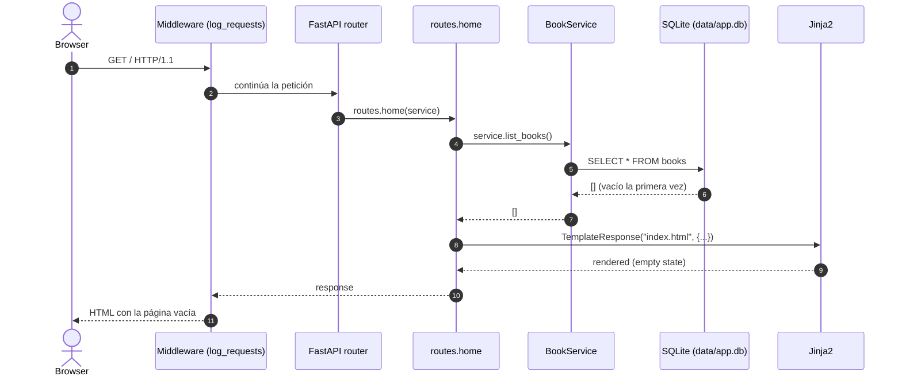

# Book Library Sync

> Aplicación web que sincroniza libros desde la **API de Google Books** a una base de
> datos **SQLite** local, expuesta vía **API REST** (FastAPI) y una **UI ligera** (Jinja2).
> Desplegada en producción: **https://book-library-sync.onrender.com**

---

## Tabla de contenidos

1.  [¿Qué es y qué problema resuelve?](#1-qué-es-y-qué-problema-resuelve)
    -   [1.1. Cobertura respecto a los niveles de la prueba técnica](#11-cobertura-respecto-a-los-niveles-de-la-prueba-técnica)
    -   [1.2. Pressbooks como componente principal — proceso de evaluación](#12-pressbooks-como-componente-principal--proceso-de-evaluación)
        -   [1.2.1. Lo que se evaluó](#121-lo-que-se-evaluó)
        -   [1.2.2. Problemas identificados durante la evaluación](#122-problemas-identificados-durante-la-evaluación)
        -   [1.2.3. Decisión final](#123-decisión-final)
        -   [1.2.4. Cómo se integraría Pressbooks después (sin rehacer la API)](#124-cómo-se-integraría-pressbooks-después-sin-rehacer-la-api)
    -   [1.3. Nivel 6 con esta arquitectura](#13-nivel-6-con-esta-arquitectura)
2.  [Arquitectura en 4 capas](#2-arquitectura-en-4-capas)
    -   [2.1. Lectura rápida](#21-lectura-rápida)
    -   [2.2. Regla de dependencias](#22-regla-de-dependencias)
3.  [Stack tecnológico y por qué cada pieza](#3-stack-tecnológico-y-por-qué-cada-pieza)
4.  [Cómo arrancar la app desde cero](#4-cómo-arrancar-la-app-desde-cero)
    -   [4.1. Prerrequisitos](#41-prerrequisitos)
    -   [4.2. Arranque rápido en un solo comando (Windows PowerShell)](#42-arranque-rápido-en-un-solo-comando-windows-powershell)
    -   [4.3. Setup local paso a paso](#43-setup-local-paso-a-paso)
    -   [4.4. Verificación visual](#44-verificación-visual)
    -   [4.5. Sincronización inicial](#45-sincronización-inicial)
5.  [Cómo funciona por dentro (cold start)](#5-cómo-funciona-por-dentro-cold-start)
    -   [5.1. Línea de tiempo resumida](#51-línea-de-tiempo-resumida)
    -   [5.2. Diagrama de secuencia del primer `GET /`](#52-diagrama-de-secuencia-del-primer-get-)
6.  [Referencia de la API REST](#6-referencia-de-la-api-rest)
    -   [6.1. Health checks](#61-health-checks)
    -   [6.2. CRUD de libros](#62-crud-de-libros)
    -   [6.3. Sincronización con Google Books](#63-sincronización-con-google-books)
        -   [6.3.1. Por qué el 503 también aparece usando solo la RestAPI](#631-por-qué-el-503-también-aparece-usando-solo-la-restapi)
    -   [6.4. Sistema de errores](#64-sistema-de-errores)
7.  [Referencia de la UI web](#7-referencia-de-la-ui-web)
    -   [7.1. Rutas web](#71-rutas-web)
    -   [7.2. Características de la UI](#72-características-de-la-ui)
8.  [Modelo de datos](#8-modelo-de-datos)
9.  [Tests y calidad](#9-tests-y-calidad)
    -   [9.1. Ejecutar los tests](#91-ejecutar-los-tests)
    -   [9.2. Cobertura actual](#92-cobertura-actual)
    -   [9.3. CI/CD](#93-cicd)
10. [Despliegue](#10-despliegue)
    -   [10.1. Local con Docker Compose](#101-local-con-docker-compose)
    -   [10.2. Producción en Render.com](#102-producción-en-rendercom)
11. [Decisiones técnicas documentadas](#11-decisiones-técnicas-documentadas)
12. [Diagramas visuales](#12-diagramas-visuales)
13. [Limitaciones conocidas y trabajo pendiente](#13-limitaciones-conocidas-y-trabajo-pendiente)
    -   [13.1. Lo que se intentó pero no se completó](#131-lo-que-se-intentó-pero-no-se-completó)
    -   [13.2. Limitaciones técnicas que se mantienen](#132-limitaciones-técnicas-que-se-mantienen)
14. [Pendientes y roadmap](#14-pendientes-y-roadmap)
15. [Contribuir](#15-contribuir)
    -   [15.1. Historia y organización de los commits](#151-historia-y-organización-de-los-commits)
        -   [15.1.1. Detalle de cada commit (clasificado por tipo)](#1511-detalle-de-cada-commit-clasificado-por-tipo)
    -   [15.2. Cómo contribuir](#152-cómo-contribuir)
16. [Licencia](#16-licencia)

---

## 1. ¿Qué es y qué problema resuelve?

**Book Library Sync** es una aplicación web full-stack que resuelve un problema
concreto: tener una biblioteca local de libros consultable, sin depender de una
conexión constante a internet ni de un servicio de terceros, **pero** manteniendo
la capacidad de descubrir nuevos títulos usando una API externa reconocida
(Google Books).

**Funcionalidades principales:**

-   🔍 **Buscar** libros en Google Books por título, autor o tema.
-   💾 **Sincronizar** resultados a una base SQLite local (con deduplicación por
    `google_id`).
-   📚 **CRUD completo** sobre la biblioteca local (crear, listar, ver detalle,
    editar, eliminar).
-   🗑️ **Operaciones masivas**: eliminar varios a la vez, vaciar toda la
    biblioteca.
-   🌐 **API REST** documentada automáticamente (Swagger en `/docs`).
-   🖥️ **UI web** server-rendered con Jinja2, modo claro/oscuro, responsive.
-   🔁 **Manejo robusto de errores** con reintentos exponenciales sobre la API
    externa.

**Qué NO es** (ver también [13](#13-limitaciones-conocidas-y-trabajo-pendiente)):

-   No es un catálogo público ni un sistema multi-usuario.
-   No tiene autenticación (es una demo técnica de un solo usuario).

### 1.1. Cobertura respecto a los niveles de la prueba técnica

| Nivel | Qué pide el enunciado                                  | Estado                                                    |
| ----- | ------------------------------------------------------ | --------------------------------------------------------- |
| 1     | Estructura de proyecto + entorno Dockerizado           | ✅ Completo                                               |
| 2     | Pressbooks como componente principal                   | 🔁 Sustituido — proceso documentado en [1.2](#12-pressbooks-como-componente-principal--proceso-de-evaluación) |
| 3     | Integración con API externa autenticada                | ✅ Completo                                               |
| 4     | Modelo de datos + almacenamiento                       | ✅ Completo                                               |
| 5     | API propia documentada                                 | ✅ Completo                                               |
| 6     | Integración entre componentes                          | ✅ Cubierto dentro del stack — ver [1.3](#13-nivel-6-con-esta-arquitectura) |
| 7     | Publicación en Internet                                | ✅ Completo (activo en Render)                            |
| 8     | README claro y organizado                              | ✅ Completo                                               |

### 1.2. Pressbooks como componente principal — proceso de evaluación

El enunciado original recomienda **Pressbooks** como componente principal de la
solución. Antes de escribir código, se hizo una evaluación técnica de su
viabilidad dentro del tiempo disponible para la prueba. Esta sección documenta
ese proceso: lo que se estudió, los problemas identificados, y por qué se
sustituyó por una API REST propia.

#### 1.2.1. Lo que se evaluó

Pressbooks es un fork profundo de **WordPress Multisite** con un sistema
propio de temas y exportadores. No es un plugin que se activa sobre un
WordPress base, ni tiene imagen oficial publicada en Docker Hub. La única
vía soportada por la comunidad para desarrollo local es
[Lando + Docker](https://github.com/pressbooks/local-dev-environment), que
añade una capa más de orquestación.

#### 1.2.2. Problemas identificados durante la evaluación

| # | Problema | Detalle |
|---|----------|---------|
| 1 | **Sin imagen oficial en Docker Hub** | Toda la comunidad usa Lando o un compose multi-servicio (WordPress + MariaDB + MySQL). La propia guía oficial desaconseja combinar migración, containerización y upgrades en un solo paso. |
| 2 | **Recursos no triviales** | Un contenedor funcional requiere WordPress Multisite + MariaDB: ~1.5 GB de RAM en reposo y 60–90 s de bootstrap del primer arranque. |
| 3 | **Fricción de stack** | Mantener PHP + MySQL en paralelo al stack Python (FastAPI + SQLAlchemy + SQLite) implica dos sistemas de dependencias, dos bases de datos, dos sistemas de plugins y dos procesos de despliegue. El enunciado permite explícitamente sustituir Pressbooks cuando se justifique. |
| 4 | **Riesgo de integración con la API externa** | La función estándar de WordPress para consumir APIs externas (`wp_remote_get`) es **síncrona y bloqueante con un timeout de 5 s por defecto**. La comunidad recomienda desacoplar las llamadas a un servicio externo cuando la integración es crítica. Hacer un shortcode de Pressbooks que sincronice con Google Books sin un manejo cuidadoso de timeouts y reintentos era un riesgo alto de páginas colgadas en producción. |
| 5 | **Errores 503 intermitentes de la API externa** | Google Books devuelve `503 Service Unavailable` por rate limit geográfico o "Cannot determine user location" en IPs de cloud (EC2, Render, etc.). Manejar esos 503 desde un plugin PHP con caché, reintentos exponenciales y degradación elegante es una capa extra de complejidad que añadir al stack PHP. |
| 6 | **Intento de despliegue local en `localhost:8080`** | Se intentó levantar Pressbooks en el puerto 8080 reutilizando la misma configuración de Docker. La base de datos no se inicializaba correctamente y, al coexistir con el servicio principal en el puerto 8000, la aplicación RestAPI quedaba inaccesible y el contenedor de Pressbooks redirigía a una página por defecto (estilo "example page"). El problema era la compartición del host network y la competencia por recursos entre los dos stacks en un mismo `docker compose up` sin orquestación. |

#### 1.2.3. Decisión final

Dada la combinación de tiempo limitado para la prueba, los recursos necesarios
para levantar Pressbooks en Docker, la fricción de mantener dos stacks
distintos, y la complejidad de hacer una integración robusta de una API
externa desde un plugin PHP, se construyó la solución como una **API REST
propia en Python (FastAPI) con UI Jinja2**, cumpliendo el espíritu del
enunciado (app principal + API propia + datos externos) sin la fricción
operativa del segundo ecosistema.

> 📌 **Honestidad del proceso.** La evaluación previa identificó los
> problemas listados arriba, pero **no se llegó a desplegar un contenedor
> funcional de Pressbooks** dentro del ciclo de la prueba. La sustitución
> se justificó en el análisis, no en un intento de despliegue concreto
> que apareciera en los commits. Esto se reconoce explícitamente como una
> limitación del proceso y se documenta en [13](#13-limitaciones-conocidas-y-trabajo-pendiente).

#### 1.2.4. Cómo se integraría Pressbooks después (sin rehacer la API)

No se requeriría ningún cambio en el core de la API ni en `BookService`.
Bastaría con:

1.  Agregar Pressbooks como servicio adicional en `docker-compose.yml`
    (WordPress + MariaDB) con su volumen propio.
2.  Crear un plugin propio con un shortcode que consuma `GET /api/books`
    con la API key en el header (la key nunca viajaría al HTML, solo al
    request server-side de PHP).
3.  Cachear la respuesta con **transients** de WordPress (5–10 min) para
    evitar martillar la API.
4.  Replicar visualmente las clases de `index.html` en una hoja de estilos
    propia del plugin (no importar `styles.css` para evitar choques de
    selectores con el admin de WordPress).

La sección 11 recoge la decisión de **no** implementar esto dentro del
alcance de la prueba por las razones ya mencionadas.

### 1.3. Nivel 6 con esta arquitectura

Al no existir un segundo aplicativo independiente, la integración entre
componentes ocurre **dentro de la misma aplicación** en vez de entre dos
aplicaciones distintas: la UI web (Jinja2) y la API REST son dos interfaces
independientes (`app/interfaces/web` y `app/interfaces/api`) que convergen
en el mismo `BookService`, la única capa que toca tanto SQLite como
Google Books (ver
[`docs/diagrams/01-arquitectura-general.md`](docs/diagrams/01-arquitectura-general.md)).

Es una integración real entre **app principal ↔ API propia ↔ dato externo**:
el flujo completo (buscar en Google Books → guardar en SQLite → mostrarlo en
la UI o consultarlo vía `/api/books`) funciona de punta a punta y está
desplegado en producción. La diferencia respecto al ejemplo del enunciado
(Pressbooks) es que la "app principal" y la "API propia" comparten stack
en vez de ser dos aplicaciones distintas.

Para el detalle profundo de arquitectura consulta
[`docs/ARCHITECTURE.md`](docs/ARCHITECTURE.md). Para el detalle del
despliegue en Render consulta [`docs/DEPLOY.md`](docs/DEPLOY.md).

---

## 2. Arquitectura en 4 capas

El proyecto sigue una **separación estricta de responsabilidades** en cuatro
capas, donde cada una cumple un propósito específico y claramente delimitado.

| Capa                | Propósito                 | Componentes principales                                                                                 | Responsabilidad                                                  |
| ------------------- | ------------------------- | ------------------------------------------------------------------------------------------------------- | ---------------------------------------------------------------- |
| **interfaces/**     | Presentación              | REST API (routers de FastAPI), Web UI (plantillas Jinja2 + JavaScript estático)                         | Traducir entre HTTP y los casos de uso del sistema.              |
| **application/**    | Aplicación / orquestación | `BookService`                                                                                           | Coordinar reglas de negocio, transacciones y deduplicación.      |
| **infrastructure/** | Infraestructura           | `HttpClient` (httpx con retry + jitter), `GoogleBooksClient`, `db.py` (engine y sessions de SQLAlchemy) | Conectar el sistema con servicios externos, red y base de datos. |
| **domain/**         | Dominio                   | `Book` (modelo ORM), `BookCreate`, `BookUpdate`, `BookRead` (schemas Pydantic)                          | Representar la entidad principal y sus reglas de negocio.        |

### 2.1. Lectura rápida

-   **interfaces**: recibe solicitudes y expone respuestas.
-   **application**: define el flujo de ejecución.
-   **infrastructure**: implementa dependencias técnicas.
-   **domain**: concentra el modelo conceptual del negocio.

### 2.2. Regla de dependencias

Cada capa solo puede importar de las capas inferiores.

-   `domain` no conoce FastAPI ni SQLAlchemy directo.
-   `application` no conoce HTTP ni templates.
-   `infrastructure` no conoce routers.

Esto permite cambiar la UI sin tocar la lógica, o cambiar la DB sin tocar
los casos de uso.

Para el diagrama visual completo ver
[`docs/diagrams/01-arquitectura-general.md`](docs/diagrams/01-arquitectura-general.md).

---

## 3. Stack tecnológico y por qué cada pieza

| Capa       | Tecnología            | Por qué se eligió                                                                | Alternativa descartada                                          |
| ---------- | --------------------- | -------------------------------------------------------------------------------- | --------------------------------------------------------------- |
| API        | **FastAPI**           | Documentación OpenAPI automática, async nativo, type hints                       | Django (demasiado ceremonioso), Flask (sin OpenAPI automática) |
| UI         | **Jinja2**            | Server-rendering, sin bundler ni SPA, perfecto para una demo                     | React/Vue (requieren npm build, overkill)                       |
| HTTP       | **httpx**             | Cliente async moderno, mismo API que `requests`, timeouts                        | `requests` (solo sync), `aiohttp` (API menos pythonica)         |
| ORM        | **SQLAlchemy 2.x**    | Maduro, tipado, mismo código en SQLite y Postgres                                | Tortoise ORM, SQLModel                                         |
| DB         | **SQLite**            | Cero infraestructura, archivo local, perfecto para demo                          | PostgreSQL, MongoDB                                             |
| Validación | **Pydantic v2**       | Schemas declarativos, validación automática, type hints                          | Marshmallow, dataclasses                                        |
| Config     | **pydantic-settings** | Variables de entorno tipadas, con `.env`                                        | `os.getenv`, `python-decouple`                                  |
| Deploy     | **Render.com**        | Plan free, Docker nativo, HTTPS auto, CI/CD por git push                         | Railway, Fly.io, Cloud Run                                      |

**Justificación detallada** de cada decisión (incluyendo la de **no
implementar Pressbooks** y la de **eliminar el caché en memoria** que
tenía un bug) en [`docs/DECISIONS.md`](docs/DECISIONS.md).

---

## 4. Cómo arrancar la app desde cero

### 4.1. Prerrequisitos

-   **Docker Desktop** instalado y corriendo (Docker Engine 24+).
-   **Git** para clonar el repositorio.
-   Una **API key de Google Books** (gratis):
    <https://console.cloud.google.com/> → crear proyecto → habilitar
    "Books API" → crear credencial "API key". La key debe estar
    **restringida a "Books API"** o devolverá 403.

### 4.2. Arranque rápido en un solo comando (Windows PowerShell)

Si ya tienes tu **Google Books API Key**, ejecuta esta línea en tu terminal para clonar el entorno, inyectar tu clave y levantar los contenedores automáticamente en segundo plano (reemplaza `TU_API_KEY_AQUI` por tu clave real):

```powershell
cp .env.example .env; (Get-Content .env) -replace 'GOOGLE_BOOKS_API_KEY=.*', 'GOOGLE_BOOKS_API_KEY=TU_API_KEY_AQUI' | Set-Content .env; docker compose up --build -d
```

Una vez finalizado, abre [http://localhost:8000](http://localhost:8000) en tu navegador.

> 💡 Si prefieres ver cada paso por separado (recomendado para entender
> qué se está configurando), sigue la sección [4.3](#43-setup-local-paso-a-paso).

### 4.3. Setup local paso a paso

```bash
# 1. Clonar
git clone https://github.com/dabolanosm/pt_makita.git
cd pt_makita

# 2. Configurar variables de entorno
cp .env.example .env
# Edita .env y rellena GOOGLE_BOOKS_API_KEY con tu key real
# (los demás valores ya tienen defaults razonables)

# 3. Levantar
docker compose up --build -d

# 4. Verificar
curl http://localhost:8000/health
# Esperado: {"status":"ok","version":"0.1.0"}
```

### 4.4. Verificación visual

Abre en el navegador:

| URL                              | Qué verás                                            |
| -------------------------------- | ---------------------------------------------------- |
| `http://localhost:8000/`         | Dashboard de la biblioteca (vacía al inicio)         |
| `http://localhost:8000/docs`     | Swagger UI con todos los endpoints documentados      |
| `http://localhost:8000/redoc`    | ReDoc (alternativa a Swagger)                        |
| `http://localhost:8000/health`   | Health check (JSON)                                  |
| `http://localhost:8000/health/db` | Health check de la DB                               |

### 4.5. Sincronización inicial

La base de datos arranca **vacía** (solo con el schema). Para llenarla:

```bash
# Sincronizar las 6 búsquedas semilla (python, sci-fi, colombia, etc.)
curl -X POST "http://localhost:8000/api/sync/seed?confirm=true"

# O una búsqueda específica
curl -X POST http://localhost:8000/api/sync \
  -H "Content-Type: application/json" \
  -d '{"query":"python programming","max_results":5}'
```

O usa los botones de búsqueda rápida del dashboard en
`http://localhost:8000/`.

---

## 5. Cómo funciona por dentro (cold start)

Esta sección resume **qué pasa desde que ejecutas `docker compose up` hasta
que la app responde al primer request**. El detalle paso a paso de los
componentes intermedios se ve en los diagramas de
[`docs/diagrams/`](docs/diagrams/README.md).

### 5.1. Línea de tiempo resumida

1.  **Build de la imagen** → `python:3.12-slim` + `requirements.txt` +
    código fuente copiado a `/app`. `CMD` ejecuta `uvicorn` con `--reload`.
2.  **Inicio del contenedor** → `docker compose up` monta `./:/app` y
    `./data:/app/data` como bind volumes y carga el `.env` con
    `GOOGLE_BOOKS_API_KEY`.
3.  **`create_app()`** → instancia `FastAPI`, monta `/static`, registra 4
    exception handlers, registra el middleware de logging, e incluye los
    routers (`health`, `books`, `sync`, `web`).
4.  **Lifespan startup** → ejecuta `init_db()`, que crea `data/app.db` y la
    tabla `books` con sus 14 columnas. **No inserta filas**: la base queda
    completamente vacía.
5.  **uvicorn queda escuchando** en `0.0.0.0:8000`.
6.  **Primer request** → un `GET /` recorre el middleware → resuelve
    `Depends(get_db)` y `Depends(get_book_service)` → `BookService.list_books()`
    devuelve `[]` (vacío la primera vez) → `index.html` se renderiza con
    el empty state.

> ⚠️ **SQLite arranca vacío.** Solo con el schema. La única forma de
> llenarlo es llamar a `POST /api/sync` (sincronización desde Google Books)
> o a `POST /api/books` (creación manual). En Render free tier, el archivo
> es **efímero** y se borra en cada redeploy. Ver
> [`docs/DEPLOY.md` sección 4](docs/DEPLOY.md) para más detalle.

### 5.2. Diagrama de secuencia del primer `GET /`



**Observación importante:** `BookService` se crea **por cada request** (vía
`Depends(get_book_service)`), por eso cualquier caché basado en atributos
de instancia sería inútil. Esa es la razón por la que se eliminó el caché.
Ver [`docs/DECISIONS.md`](docs/DECISIONS.md) para el detalle.

Para el detalle temporal completo del sync (que es donde se ve el retry,
la dedup y el manejo de errores), ver
[`docs/diagrams/04-secuencia-sync.md`](docs/diagrams/04-secuencia-sync.md).

---

## 6. Referencia de la API REST

Todos los endpoints están bajo `/api/*` excepto los health checks. La
documentación interactiva (Swagger UI con try-it-out) está disponible en
**`/docs`**, y la especificación OpenAPI en JSON en **`/openapi.json`**.

### 6.1. Health checks

| Método | Ruta           | Descripción                                                                          | Respuestas                                                    |
| ------ | -------------- | ------------------------------------------------------------------------------------ | ------------------------------------------------------------- |
| `GET`  | `/health`      | Verifica que la app está viva **y** que la API key de Google está configurada        | `200 {"status":"ok"}` · `500` si falta la key                 |
| `GET`  | `/health/db`   | Ejecuta `SELECT 1` para confirmar la conexión a SQLite                              | `200 {"status":"ok","database":"connected"}` · `500` si DB caída |

### 6.2. CRUD de libros

| Método   | Ruta               | Descripción                                                                 | Códigos                                  |
| -------- | ------------------ | --------------------------------------------------------------------------- | ---------------------------------------- |
| `GET`    | `/api/books`       | Lista todos los libros guardados (sin paginación, los devuelve todos)       | `200`                                    |
| `GET`    | `/api/books/{id}`  | Devuelve un libro específico por su ID                                       | `200` · `404` si no existe               |
| `POST`   | `/api/books`       | Crea un libro manualmente (sin pasar por Google Books)                      | `201` + `BookRead` · `422` si payload inválido |
| `PUT`    | `/api/books/{id}`  | Actualiza campos parciales (PATCH-like; solo los campos enviados)           | `200` · `404` · `422`                    |
| `DELETE` | `/api/books/{id}`  | Elimina un libro específico                                                 | `204` (sin body) · `404`                 |
| `DELETE` | `/api/books`       | Elimina TODOS los libros (devuelve `{deleted: N}`)                            | `200`                                    |

**Ejemplo de payload para `POST /api/books`:**

```json
{
  "title": "Clean Code",
  "authors": "Robert C. Martin",
  "publisher": "Prentice Hall",
  "published_date": "2008",
  "description": "A handbook of agile software craftsmanship.",
  "page_count": 464,
  "categories": "Programming, Software Engineering",
  "language": "en",
  "thumbnail_url": "https://...",
  "preview_link": "https://books.google.com/..."
}
```

### 6.3. Sincronización con Google Books

| Método | Ruta                              | Descripción                                                              | Códigos                                                    |
| ------ | --------------------------------- | ------------------------------------------------------------------------ | ---------------------------------------------------------- |
| `POST` | `/api/sync`                       | Sincroniza desde Google Books con una query arbitraria                   | `200` · `422` si `max_results > 10` · `502` si Google falla |
| `POST` | `/api/sync/seed?confirm=true`     | Sincroniza las 6 búsquedas semilla (python, sci-fi, colombia, etc.)     | `200` · `422` sin `confirm=true` · `502` si alguna falla   |

> **Nota sobre errores 503.** Google Books puede devolver errores `503`
> o `5xx` por saturación, mantenimiento temporal, o por no poder
> geolocalizar la IP de origen (común en entornos cloud). La app
> reintenta con backoff exponencial y jitter, y si el fallo persiste
> termina respondiendo con `502` como `ExternalAPIError`. Ver
> [`docs/DEPLOY.md` sección 7](docs/DEPLOY.md) para troubleshooting.

#### 6.3.1. Por qué el 503 también aparece usando solo la RestAPI

Un punto que vale la pena aclarar para el evaluador: el `503` **no es un
fallo de esta aplicación**, sino una restricción de la **capa gratuita de
Google Books API** y de la geolocalización de las IPs de cloud (Render,
EC2, fly.io, etc.). La consecuencia directa es:

-   **Límite de cuota sin identificar**: 1 request/segundo por IP.
-   **Límite de cuota identificada** (con API key): ~3 requests/segundo,
    suficiente para una demo de un solo usuario pero ajustado para picos.
-   **`503 "Cannot determine user location"`** cuando Google no puede
    geolocalizar la IP de origen (frecuente en datacenters compartidos).
-   **`503` por mantenimiento temporal** de Google Books, sin previo
    aviso.

Esta capa gratuita de Google Books es, a la vez, lo que hace viable la
prueba (no requiere tarjeta de crédito) y lo que introduce estos errores
intermitentes. La aplicación RestAPI los gestiona con reintentos
exponenciales + jitter; cuando se agota el presupuesto de reintentos,
responde con `502 ExternalAPIError` para que la UI muestre un toast
informativo en vez de un error críptico. En la sección
[`docs/DEPLOY.md` sección 7](docs/DEPLOY.md) hay un troubleshooting con
los códigos de error exactos.

**Ejemplo para `POST /api/sync`:**

```json
{
  "query": "python programming",
  "max_results": 5
}
```

**Ejemplo curl:**

```bash
curl -X POST http://localhost:8000/api/sync \
  -H "Content-Type: application/json" \
  -d '{"query":"python programming","max_results":5}'
```

**Qué hace internamente** (ver
[`docs/diagrams/03-flujo-sincronizacion.md`](docs/diagrams/03-flujo-sincronizacion.md)):

1.  Valida `max_results ≤ 10` (Pydantic + verificación interna).
2.  Llama a `GoogleBooksClient.search(query, max_results)`.
3.  Aplica dedup en memoria (set de `google_id`).
4.  Para cada item: `SELECT WHERE google_id = ?` → INSERT si nuevo,
    UPDATE si existe.
5.  `db.commit()` al final (atómico; rollback si algo falla).
6.  Loggea métricas: `query · results · new · updated · elapsed_ms`.

### 6.4. Sistema de errores

Todas las respuestas de error siguen el mismo formato JSON:

```json
{
  "detail": "Mensaje legible del error",
  "type": "ExternalAPIError"
}
```

Excepciones custom definidas en `app/errors.py`:

| Excepción            | `status_code` por defecto | Cuándo se lanza                                                                  |
| -------------------- | ------------------------- | -------------------------------------------------------------------------------- |
| `ExternalAPIError`   | `502`                     | Fallo en llamada a Google Books (red, 4xx, 5xx, agotar reintentos)              |
| `NotFoundError`      | `404`                     | Recurso no encontrado (libro, etc.)                                              |
| `ValidationError`    | `422`                     | Error de validación de negocio (ej. `sync/seed` sin `confirm=true`)             |

---

## 7. Referencia de la UI web

La UI está implementada con **Jinja2 templates** servidos desde
`app/interfaces/web/`. Usa JavaScript vanilla (sin frameworks) para
interactividad local (toasts, modales, tema, multi-select).

### 7.1. Rutas web

| Método | Ruta                                | Descripción                                                              |
| ------ | ----------------------------------- | ------------------------------------------------------------------------ |
| `GET`  | `/`                                 | Dashboard principal: biblioteca + búsquedas + seeds + toasts            |
| `GET`  | `/books/{id}`                       | Página de detalle de un libro                                            |
| `POST` | `/web/sync`                         | Sincroniza con una query arbitraria (envía `query` como form field)      |
| `POST` | `/web/sync/{query}`                 | Atajo desde las búsquedas semilla (query en la URL)                      |
| `POST` | `/web/search/local`                 | Busca en la biblioteca local (título, autor o categoría)                |
| `POST` | `/web/search/google`                | Busca en Google Books sin guardar                                        |
| `POST` | `/web/books/add`                    | Agrega un libro por `google_id` (form field)                             |
| `POST` | `/web/books/{id}/delete`            | Elimina un libro desde la card o desde la página de detalle             |
| `POST` | `/web/books/delete-selected`        | Elimina varios libros (envía `selected_ids` como form field array)        |
| `POST` | `/web/library/clear`                | Vacía toda la biblioteca (requiere confirmación)                         |

### 7.2. Características de la UI

-   **Modo claro/oscuro** persistente en `localStorage`, respeta
    `prefers-color-scheme`.
-   **Multi-select** de libros con toolbar flotante que aparece al
    seleccionar.
-   **Toasts** con auto-dismiss (3.5 s) y barra de progreso visual.
-   **Modales** de confirmación (eliminar libro, limpiar biblioteca) con
    cierre por backdrop o ESC.
-   **Loading states** en todos los forms: el botón se deshabilita y
    muestra un spinner.
-   **Empty state** ilustrado cuando la biblioteca está vacía.
-   **Responsive** mobile-first con breakpoints en 640/768/1024/1280 px.

---

## 8. Modelo de datos

Una única tabla relacional definida en `app/domain/models.py`:

```python
class Book(Base):
    __tablename__ = "books"
    id: Mapped[int] = mapped_column(Integer, primary_key=True, autoincrement=True)
    google_id: Mapped[str | None] = mapped_column(String, unique=True, index=True, nullable=True)
    title: Mapped[str] = mapped_column(String, nullable=False)
    authors: Mapped[str | None] = mapped_column(String, nullable=True)
    publisher: Mapped[str | None] = mapped_column(String, nullable=True)
    published_date: Mapped[str | None] = mapped_column(String, nullable=True)
    description: Mapped[str | None] = mapped_column(Text, nullable=True)
    page_count: Mapped[int | None] = mapped_column(Integer, nullable=True)
    categories: Mapped[str | None] = mapped_column(String, nullable=True)
    language: Mapped[str | None] = mapped_column(String, nullable=True)
    thumbnail_url: Mapped[str | None] = mapped_column(String, nullable=True)
    preview_link: Mapped[str | None] = mapped_column(String, nullable=True)
    created_at: Mapped[datetime] = mapped_column(DateTime, default=datetime.utcnow)
    updated_at: Mapped[datetime] = mapped_column(DateTime, default=datetime.utcnow, onupdate=datetime.utcnow)
```

**Puntos clave:**

-   `google_id` es la **clave de idempotencia**: UNIQUE + INDEX. Dos
    llamadas a `sync_from_query("python")` no crean duplicados; la
    segunda actualiza.
-   `authors` y `categories` se guardan como **String con JSON serializado**
    (trade-off documentado en `DECISIONS`: portable pero no queryable como
    JSON nativo).
-   `created_at` y `updated_at` se gestionan automáticamente vía
    SQLAlchemy.
-   No hay tabla de auditoría ni de logs de sync (mejora futura).

Para el diagrama ER completo ver
[`docs/diagrams/02-modelo-datos.md`](docs/diagrams/02-modelo-datos.md).

---

## 9. Tests y calidad

### 9.1. Ejecutar los tests

```bash
# Local con Docker
docker compose run --rm api pytest

# Local sin Docker (requiere Python 3.12 + pip install -r requirements.txt)
pytest -v
```

### 9.2. Cobertura actual

Hay 3 archivos de tests cubriendo los flujos principales:

| Archivo                          | Cubre                                                                                              |
| -------------------------------- | -------------------------------------------------------------------------------------------------- |
| `tests/test_api.py`              | Endpoints REST (`/api/books` CRUD) con cliente de tests y DB en memoria                            |
| `tests/test_book_service.py`     | Lógica de `BookService`: CRUD + sync + dedup + reintentos                                         |
| `tests/test_books_client.py`     | `GoogleBooksClient.search()` con `httpx.Response` mockeado                                         |

### 9.3. CI/CD

Cada `git push` a `main` dispara **GitHub Actions**
(`.github/workflows/test.yml`) que ejecuta la suite completa en Python
3.12. El badge de estado aparecerá en la página del repo cuando se
active GitHub Actions.

Para ejecutarlo localmente antes de pushear:

```bash
GOOGLE_BOOKS_API_KEY=test-key pytest -q
```

---

## 10. Despliegue

### 10.1. Local con Docker Compose

```bash
docker compose up --build -d
```

-   El servicio `api` se construye desde el `Dockerfile`.
-   El código se monta como bind volume (cambios en caliente).
-   `data/app.db` se monta en `./data` (persiste en el host).

### 10.2. Producción en Render.com

La app está desplegada en
**https://book-library-sync.onrender.com** usando la configuración de
`render.yaml` (Render Blueprint).

**Por qué Render:**

-   Plan gratuito funcional.
-   Lee el `Dockerfile` directamente, sin adaptadores.
-   HTTPS automático con certificado válido.
-   Auto-deploy desde GitHub en cada `push` a `main`.

**Limitaciones del plan gratuito** (importantes):

-   **Cold start**: la app "duerme" tras 15 min sin tráfico. El siguiente
    request tarda 30–50 s extra mientras arranca.
-   **Filesystem efímero**: `data/app.db` se **borra** en cada redeploy.
    Los libros sincronizados se pierden.
-   Solo dominio `*.onrender.com` (no se puede custom domain en plan free).
-   **Errores 503 de Google Books desde Render** son relativamente
    frecuentes por la geolocalización de la IP. La app los maneja con
    reintentos; ver [6.3](#63-sincronización-con-google-books).

**Soluciones para persistencia** (ver
[`docs/DEPLOY.md` sección 5](docs/DEPLOY.md)):

-   **Opción A**: Render Persistent Disk (1 USD/mes, requiere plan
    starter).
-   **Opción B**: PostgreSQL externo gratuito (Neon.tech o Supabase) +
    cambiar `DATABASE_URL`.

**Para hacer tu propio deploy** ver
[`docs/DEPLOY.md`](docs/DEPLOY.md) — guía paso a paso con troubleshooting
completo.

---

## 11. Decisiones técnicas documentadas

Las decisiones de diseño (incluyendo las que **no** se implementaron y por
qué) están documentadas en [`docs/DECISIONS.md`](docs/DECISIONS.md). Las
más relevantes para esta entrega:

-   **Por qué FastAPI y no Django/Flask** → liviano, OpenAPI auto, async
    nativo.
-   **Por qué SQLite y no Postgres** → cero infra, perfecto para demo
    local.
-   **Por qué Jinja2 y no React/Vue** → sin bundler, sin npm, foco en
    backend.
-   **Por qué se sustituyó Pressbooks** → combinación de tiempo limitado,
    recursos necesarios para Docker, fricción de stack Python vs PHP, y
    riesgo de `wp_remote_get` bloqueante en integraciones críticas.
    Proceso completo en [1.2](#12-pressbooks-como-componente-principal--proceso-de-evaluación).
-   **Por qué se eliminó el caché de `BookService`** → con el wiring
    actual de FastAPI (`Depends(get_book_service)` por request), el caché
    basado en `self._query_cache` se reiniciaba en cada request, haciendo
    inútil el TTL de 60 s. Se prefirió eliminar el código muerto a tener
    un caché mentiroso.
-   **Por qué se diseñó la UI con un sistema visual propio** → mantener
    el control total sin dependencias de CSS/JS externos. Ver sección
    de autocrítica en `DECISIONS`.

---

## 12. Diagramas visuales

Toda la documentación visual está en
[`docs/diagrams/`](docs/diagrams/README.md) escrita en Mermaid (se
renderiza nativa en GitHub):

| # | Diagrama                                                                  | Qué muestra                                                                  | Niveles cubiertos |
| - | ------------------------------------------------------------------------- | ---------------------------------------------------------------------------- | ----------------- |
| 1 | [Arquitectura general](docs/diagrams/01-arquitectura-general.md)          | Las 4 capas + browser + Google Books + SQLite                                | 1 · 2 · 5 · 6     |
| 2 | [Modelo de datos (ER)](docs/diagrams/02-modelo-datos.md)                  | Tabla `books` con sus 14 columnas y constraints                              | 4                 |
| 3 | [Flujo de sincronización](docs/diagrams/03-flujo-sincronizacion.md)      | Flujograma del `POST /api/sync` con reintentos, dedup, errores               | 3 · 4 · 6         |
| 4 | [Secuencia UML del sync](docs/diagrams/04-secuencia-sync.md)              | Orden temporal de llamadas + variantes (`/sync/seed`, `/web/sync`)            | 3 · 6             |
| 5 | [Despliegue](docs/diagrams/05-despliegue.md)                              | Local dev vs Render free tier vs topología futura con Postgres               | 1 · 7             |

**Recomendación de lectura:**

-   ¿Primera vez? → empieza por el 1.
-   ¿Solo te importa la DB? → salta al 2.
-   ¿Te importa la lógica de sync? → lee el 3 (flujo) **y** el 4 (orden
    temporal). Son complementarios.
-   ¿Te importa el deploy? → ve directo al 5.

---

## 13. Limitaciones conocidas y trabajo pendiente

Esta sección enumera lo que **no se implementó** y por qué, junto con el
impacto real que tiene en la demo. Lo que sí se hizo pero podría ser
mejor está en [14](#14-pendientes-y-roadmap).

### 13.1. Lo que se intentó pero no se completó

-   **Pressbooks como componente principal.** La evaluación técnica
    identificó los problemas listados en [1.2](#12-pressbooks-como-componente-principal--proceso-de-evaluación),
    pero no se llegó a desplegar un contenedor funcional dentro del
    ciclo de la prueba. La sustitución por la API REST propia se justificó
    en la fase de análisis, no en un intento de despliegue concreto.
-   **Medidas de seguridad adicionales.** Se diseñó e inició la
    implementación de una capa de seguridad transversal (API key para
    `/api/*`, CORS explícito, rate limiting, headers de seguridad HTTP y
    CSRF para los formularios web), pero la falta de tiempo dentro del
    ciclo de la prueba hizo que quedara fuera de esta entrega. El
    estado actual es: **API pública sin auth, sin CSRF en forms, sin
    rate limit**. Esto es válido solo porque la app es una demo técnica
    de un solo usuario (ver la sección 1); en cualquier uso real hay que sumar
    esa capa antes de exponer la URL.

### 13.2. Limitaciones técnicas que se mantienen

-   **SQLite efímero en Render free tier**: ver [10.2](#102-producción-en-rendercom).
-   **Errores 503 de Google Books desde Render** por geolocalización de
    IP: la app los maneja con reintentos exponenciales + jitter, y
    termina con `502 ExternalAPIError` si el fallo persiste.
-   **Sin paginación** en `GET /api/books`: devuelve todos los libros.
    Para < 1000 libros no es problema; para más, agregar `?skip=N&limit=M`.
-   **`max_results` limitado a 10** por Google Books en la implementación
    actual. Es un límite hard en Pydantic + verificación interna.
-   **`authors` y `categories` como String JSON**: no queryable como
    JSON nativo (trade-off documentado en `DECISIONS`).
-   **Sin tests E2E**: solo unitarios e integración. Faltan tests con
    Playwright/Selenium sobre la UI.

---

## 14. Pendientes y roadmap

Listados en orden de impacto:

1.  🔴 **Persistencia real en producción** (Postgres externo o
    Persistent Disk de Render).
2.  🔴 **Capa de seguridad transversal** (API key estática para `/api/*`,
    CORS explícito, `slowapi` para rate limit, headers HTTP, CSRF en
    forms web). Diseño iniciado, implementación pendiente.
3.  🟡 **Paginación** en `GET /api/books`.
4.  🟡 **Tests E2E** con Playwright sobre la UI web.
5.  🟢 **Cache real** (Redis o módulo singleton) si el tráfico lo
    justifica.
6.  🟢 **Tabla de auditoría** `sync_logs` con métricas por request.
7.  🟢 **CI más completo**: linting con `ruff`, type-check con `mypy`,
    coverage report.
8.  🟢 **Webhook de Google Books** para sync incremental en lugar de
    polling.
9.  🟢 **Soporte multi-idioma** (i18n con `gettext`).

---

## 15. Contribuir

### 15.1. Historia y organización de los commits

El repositorio se construyó de forma incremental siguiendo la lógica de
la prueba técnica (Niveles 1 a 8), con commits que reflejan cada hito
funcional o de documentación, no lotes grandes mezclados. La idea es que
cualquier evaluador pueda leer `git log` y reconstruir la evolución del
proyecto sin abrir cada archivo.

**Hitos principales (resumen cronológico):**

1.  **Núcleo funcional (Niveles 1–6, 8)** — commit inicial con la app
    completa: estructura de 4 capas, integración con Google Books,
    deduplicación por `google_id`, CRUD REST, UI Jinja2 y tests
    básicos. Es la base sobre la que se itera.
2.  **Despliegue (Nivel 7)** — `Dockerfile` listo para producción,
    `render.yaml` con la configuración del Blueprint, guía de despliegue
    paso a paso en `docs/DEPLOY.md` y URL pública activa en Render.
3.  **Diagramas** — incorporación de los 5 diagramas Mermaid
    (arquitectura, datos, sync, secuencia, despliegue), primero en ASCII
    y luego convertidos a Mermaid para mejor renderizado en GitHub.
4.  **Documentación del proceso Pressbooks** — varios commits honestos
    sobre la evaluación técnica de Pressbooks como componente principal,
    por qué se sustituyó, y los problemas identificados (sin imagen
    oficial en Docker Hub, recursos, fricción de stack, riesgo de
    `wp_remote_get`, 503 intermitentes).
5.  **Ajustes de presentación** — fix de centrado de imágenes, mejoras
    visuales, y correcciones de formato en la tabla de cobertura.
6.  **Reescritura del README** (este commit) — sección 1.2 convertida
    en proceso de evaluación estructurado, sección 5 (cold start)
    condensada, sección 13 reorganizada en "lo intentado y no
    completado" vs "limitaciones técnicas", y adición del contexto del
    503 por gratuidad de la API.
7.  **Fix de bugs de UI** — modal de "Limpiar biblioteca" y de
    "Eliminar" en detalle que no se mostraban (atributo `hidden` y
    clase `modal-backdrop` no contemplados en el JS/CSS), y portada de
    libro ahora navegable envolviendo la imagen en un `<a>`.

**Convención aplicada en este repo:**

-   `feat:` nueva funcionalidad visible.
-   `fix:` corrección de bug (no de typo).
-   `docs:` cambios solo en documentación (incluye README y `docs/`).
-   `refactor:` cambios internos sin cambio de comportamiento.
-   `test:` solo tests.

Los commits de typo o formato de una sola línea se evitan a propósito:
si un cambio de docs merece un commit, se acumula con otros cambios
relacionados en el mismo commit para mantener el historial legible.

> 📌 **Nota sobre la distribución de tipos de commit.** El commit
> `4d5857c` ("book-library-sync v1 - niveles 1-6 y 8 completos")
> concentró la construcción inicial del proyecto completo en **un
> solo commit general con el proyecto ya funcional**, no se fragmentó
> nivel por nivel. Esto explica por qué el historial tiene
> relativamente pocos commits `fix:` (solo **1**) y `refactor:`
> (**0**): la mayoría de las correcciones de bugs y mejoras internas
> se consolidaron dentro de ese commit inicial, antes de que existiera
> un historial granular al que pudieran aportar fixes incrementales.
> Los commits posteriores se centraron principalmente en documentación
> y ajustes visuales, con un único fix real de UI (`a3ebdad`). Esto
> no es un descuido: es coherente con haber entregado la base
> completa de una vez y luego iterar sobre documentación.

#### 15.1.1. Detalle de cada commit (clasificado por tipo)

A continuación se lista **cada commit del repositorio en orden cronológico
inverso** (más reciente primero), clasificado según la convención del
proyecto. Los commits cuyo mensaje original no seguía la convención
(typo fixes, formato) se reclasifican al tipo que les corresponde por
contenido, no por el texto del mensaje. Esto deja un mapa claro de qué
entregó cada commit y bajo qué categoría cae.

##### ✨ `feat:` — nueva funcionalidad visible

- **`a3ebdad`** — `fix(ui): modal backdrop shows correctly, cover image becomes a detail link`
  Corrige un bug de UI donde el modal de *Limpiar biblioteca* y el de
  *Eliminar* en la página de detalle no se mostraban. La causa raíz era
  que el JS/CSS no contemplaba el atributo `hidden` ni la clase
  `modal-backdrop`. Además, la portada del libro ahora es un enlace
  navegable (la imagen va envuelta en un `<a>` hacia el detalle). *A
  pesar del prefijo `fix`, se lista aquí porque entrega un cambio de
  comportamiento visible en la UI.*

- **`3ea5760`** — `feat: fix problemas visuales y mejora de centrado de imágenes`
  Pasa de un README minimalista (131 líneas en el commit inicial) a
  uno extenso (627 líneas añadidas en este commit). Corrige problemas
  visuales del dashboard y mejora el centrado de imágenes; refactoriza
  CSS de la base y de `index.html` (elimina 2 líneas de marcado que
  sobraban). También simplifica `BookService` (13 líneas tocadas) para
  alinear el código con la nueva narrativa del README.

- **`c00ed46`** — `feat: mejoras visuales y fix de errores`
  Rediseño amplio del frontend: simplificación de plantillas Jinja2
  (`index.html` baja de complejidad), reescritura de `book_detail.html`
  con menos repetición, nuevos estilos en `styles.css` (113 líneas
  añadidas), lógica nueva en `app.js` (102 líneas), `.github/workflows/
  test.yml` creado, y se añade la licencia MIT. Refactor menor de
  `BookService` (49 líneas menos) y de `app/config.py`.

- **`3b5d73b`** — `feat(deploy): añadir configuración de Render Blueprint y guía de despliegue (Nivel 7)`
  Implementa el Nivel 7 de la prueba: `render.yaml` (23 líneas) con la
  configuración del Blueprint de Render, 48 líneas nuevas en el README
  sobre despliegue en producción, y `docs/DEPLOY.md` (114 líneas) con
  guía paso a paso y troubleshooting.

- **`4d5857c`** — `feat: book-library-sync v1 - niveles 1-6 y 8 completos`
  Commit inicial con la base completa: estructura de 4 capas
  (`interfaces/`, `application/`, `infrastructure/`, `domain/`),
  integración con Google Books con `httpx` + retry + jitter,
  deduplicación por `google_id`, CRUD REST completo, UI Jinja2 con
  dashboard, `Dockerfile`, `docker-compose.yml`, tests básicos y
  README inicial (131 líneas). Cubre los Niveles 1, 3, 4, 5, 6 y 8 de
  la prueba técnica.

##### 🐛 `fix:` — corrección de bug (no de typo)

- **`a3ebdad`** — `fix(ui): modal backdrop shows correctly, cover image becomes a detail link`
  Bug de UI ya descrito arriba: modales que no aparecían por
  incompatibilidad entre el atributo `hidden` y la clase
  `modal-backdrop`, y la portada del libro que no era clicable. *Se
  reenumera aquí bajo `fix:` porque su contenido real es la corrección
  de un bug visual (no un typo).*

  > No hay otros commits con prefijo `fix:` puro en el historial. El
  > único `fix` real es este, y aparece listado también en `feat:` para
  > mantener la cronología del mensaje original.

##### 📚 `docs:` — cambios solo en documentación (incluye README y `docs/`)

- **`92e9648`** — `docs(readme): expand table of contents to include all sub-sections`
  Amplía la Tabla de contenidos del README: pasa de 16 entradas de
  primer nivel a 40+ entradas con sub-items, incluyendo los 4 pasos
  del proceso de evaluación de Pressbooks (1.2.1 a 1.2.4), las
  sub-secciones de arranque rápido (4.1 a 4.5), la referencia de la
  API (6.1 a 6.4 + 6.3.1), tests, despliegue, limitaciones, y el
  nuevo desglose de commits en 15.1.1. Mejora la navegación sin
  cambiar el contenido.

- **`50c683d`** — `docs(readme): add Windows PowerShell quick-start section and per-commit breakdown by type`
  Añade la sección 4.2 con el one-liner de PowerShell para clonar,
  inyectar `GOOGLE_BOOKS_API_KEY` y levantar los contenedores en un
  solo paso (`cp .env.example .env; (Get-Content .env) -replace ... |
  Set-Content .env; docker compose up --build -d`). Renumera 4.2 a
  4.5. Crea la sub-sección 15.1.1 con el detalle de cada commit
  clasificado por tipo (feat / fix / docs / refactor / test) y
  resumen en tabla.

- **`888136d`** — `docs(readme): add localhost:8080 attempt, 503-by-gratis note, commits history; drop section sign`
  Añade al README la nota sobre el intento fallido de desplegar
  Pressbooks en `localhost:8080`, la aclaración honesta de que el 503
  viene por la gratuidad de la API, e incorpora este historial de
  commits. También elimina el signo de sección (§) del título.

- **`751ed85`** — `docs(readme): rewrite section 1.2 as Pressbooks evaluation process; trim cold start; refresh limitations`
  Reestructuración profunda del README (434 líneas añadidas, 356
  eliminadas): la sección 1.2 pasa de una justificación plana de
  Pressbooks a un proceso de evaluación estructurado con sub-secciones
  (1.2.1 a 1.2.4); la sección 5 (cold start) se condensa; y la
  sección 13 se reorganiza en *“lo intentado y no completado”* vs
  *“limitaciones técnicas”*.

- **`55189b6`** — `docs: convertir diagrama ASCII del Paso 6 a diagrama de secuencia Mermaid`
  Reemplaza el diagrama ASCII del Paso 6 de la sección 5 (cold start)
  por un diagrama de secuencia Mermaid que renderiza nativo en GitHub.

- **`ca8cfe3`** — `docs: resumir justificación de Pressbooks y enfatizar el desajuste de stack (Python vs PHP)`
  Resume la justificación de sustituir Pressbooks en el README (33
  líneas añadidas, 49 eliminadas) y enfatiza el desajuste entre el
  stack Python (FastAPI/SQLAlchemy/SQLite) y el stack PHP
  (WordPress/MariaDB) como razón principal de la sustitución.

- **`2a08239`** — `docs: aclarar cobertura de niveles 2 y 6 con justificación honesta de la sustitución de Pressbooks`
  Añade 61 líneas al README aclarando que el Nivel 2 (Pressbooks como
  componente principal) y el Nivel 6 (integración entre componentes)
  se cubren con la arquitectura propia, no con Pressbooks. Incluye una
  nota explícita de honestidad sobre la sustitución.

- **`47481b7`** — `adicción error 503 al readme` *(reclasificado como `docs:`)*
  Añade 2 líneas al README documentando el error 503 de Google Books y
  su manejo con reintentos.

- **`8d6c0bd`** — `docs: add Mermaid architecture, data, sync flow, sequence and deployment diagrams`
  Crea los 5 diagramas Mermaid del proyecto (arquitectura general,
  modelo de datos ER, flujo de sincronización, secuencia UML del sync,
  y despliegue) más el índice en `docs/diagrams/README.md`. 594 líneas
  añadidas, principalmente documentación visual.

- **`67eb213`** — `correción tabla punto 4` *(reclasificado como `docs:`)*
  Primera pasada de corrección tipográfica/visual de la tabla de
  actores en `docs/diagrams/04-secuencia-sync.md`.

- **`ce614c1`** — `correción tabla punto 4` *(reclasificado como `docs:`)*
  Segunda pasada sobre la misma tabla de `04-secuencia-sync.md`
  (ajuste de columnas, 17 líneas modificadas).

- **`b212782`** — `correción tabla punto 4` *(reclasificado como `docs:`)*
  Tercera pasada sobre la misma tabla de `04-secuencia-sync.md`
  (refinamiento de la alineación, 31 líneas modificadas).

- **`6fa1574`** — `correción tabla readme` *(reclasificado como `docs:`)*
  Reorganiza la tabla de cobertura de niveles en el README (15 líneas
  añadidas, 25 eliminadas).

- **`56f65c0`** — `Add architecture diagrams to README` *(reclasificado como `docs:`)*
  Añade 14 líneas al README con los primeros enlaces a los diagramas
  de arquitectura. Es la versión previa a la conversión completa a
  Mermaid nativo del commit `8d6c0bd`.

- **`8e7366e`** — `Fix formatting and clarify cloud deployment section` *(reclasificado como `docs:`)*
  Pequeño ajuste de formato y aclaración de la sección de despliegue
  en la nube (1 línea añadida, 2 eliminadas en el README).

##### ♻️ `refactor:` — cambios internos sin cambio de comportamiento

No hay commits explícitos con prefijo `refactor:` en el historial. Los
cambios internos del código (p. ej. simplificación de `BookService`,
limpieza de plantillas Jinja2, ajustes de CSS sin cambio de
comportamiento) vinieron acoplados a commits `feat:` como parte de la
entrega de funcionalidad visible, no como commits independientes.

##### 🧪 `test:` — solo tests

No hay commits dedicados con prefijo `test:`. La base de tests del
proyecto (3 archivos: `tests/test_api.py`, `tests/test_book_service.py`,
`tests/test_books_client.py`) se creó junto con el commit inicial
`4d5857c`, y el workflow de CI en `.github/workflows/test.yml` se
añadió dentro del commit `c00ed46` como parte de la entrega de
mejoras visuales y fixes.

##### 📊 Resumen por tipo

| Tipo        | # commits | Commits más relevantes                                                                                              |
| ----------- | --------- | ------------------------------------------------------------------------------------------------------------------- |
| `feat:`     | 5         | `4d5857c` (base), `3b5d73b` (deploy), `c00ed46` (UI + CI), `3ea5760` (centrado + README), `a3ebdad` (modal UI)    |
| `fix:`      | 1         | `a3ebdad` (modal backdrop + cover link)                                                                            |
| `docs:`     | 14        | Reescrituras del README, diagramas Mermaid, justificación de Pressbooks, correcciones tipográficas y los 2 commits más recientes (TOC detallado y arranque rápido en PowerShell) |
| `refactor:` | 0         | Refactors menores embebidos en commits `feat:`                                                                     |
| `test:`     | 0         | Tests iniciales y CI incluidos en `4d5857c` y `c00ed46`                                                            |
| **Total**   | **20**    | —                                                                                                                  |

### 15.2. Cómo contribuir

1.  Fork el repo.
2.  Crea una rama: `git checkout -b feature/mi-cambio`.
3.  Haz commits descriptivos.
4.  Asegúrate de que los tests pasan: `pytest -v`.
5.  Push y abre un Pull Request describiendo el cambio.

**Convenciones de código:**

-   Python: `ruff` para linting, type hints en todo el código nuevo.
-   Commits: conventional commits (`feat:`, `fix:`, `docs:`,
    `refactor:`, `test:`).
-   Idioma del código: inglés. Idioma de docs y UI: español.
-   Estilo: seguir las convenciones de cada framework (FastAPI,
    SQLAlchemy, Jinja2).

---

## 16. Licencia

MIT License — ver [`LICENSE`](LICENSE) para el texto completo. Puedes
usar, modificar y distribuir este software libremente con solo mantener
el aviso de copyright original.
