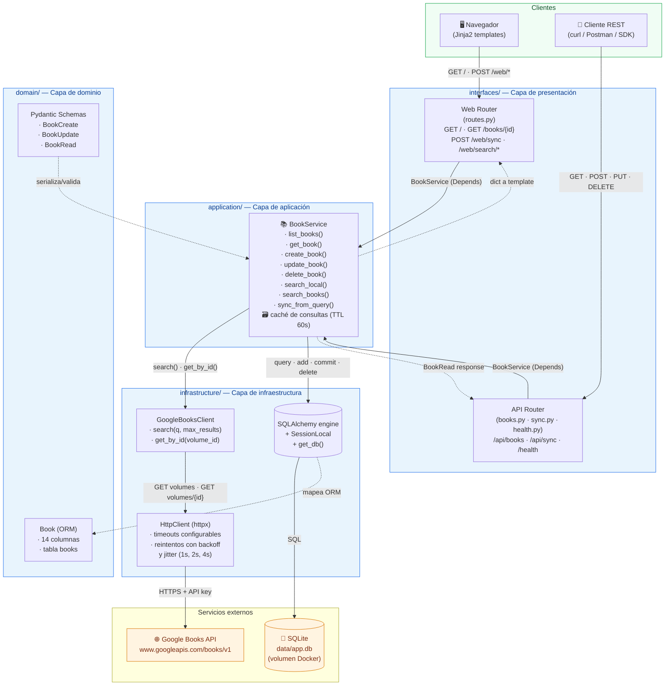

# Diagrama 1 — Arquitectura general (4 capas)

**Niveles cubiertos:** 1 (Docker) · 2 (Aplicación principal) · 5 (API propia) · 6 (Integración)

Este diagrama muestra cómo se organizan los componentes de **Book Library Sync** y cómo
interactúan entre sí. Refleja la separación en cuatro capas implementada en `app/`:

- `domain` → modelos y esquemas Pydantic (sin dependencias externas).
- `infrastructure` → SQLAlchemy, `HttpClient`, `GoogleBooksClient`.
- `application` → `BookService` (orquesta casos de uso).
- `interfaces` → routers REST (`/api/*`) y rutas web (Jinja2).

Los tres caminos de entrada (UI web, API REST, sync externo) convergen en `BookService`,
que es la única capa que toca tanto la base de datos local como la API externa.

## Reglas de dependencia

- Las flechas sólidas (**→**) indican **llamadas reales** (HTTP, SQL, función).
- Las flechas punteadas (**-.->**) indican **mapeo o transformación** (ORM, Pydantic).
- Una capa **nunca** importa de una capa superior. `domain` no conoce FastAPI ni SQLAlchemy
  directo (lo hace a través de la sesión inyectada). `application` no conoce HTTP ni
  templates. `infrastructure` no conoce routers.

## Puntos clave para la evaluación

| Punto | Dónde se ve |
|---|---|
| Separación de responsabilidades | 4 subgrafos sin ciclos |
| Inyección de dependencias | `Depends(get_db)` + `Depends(get_book_service)` |
| Aislamiento del cliente externo | `HttpClient` con reintentos envuelve a `GoogleBooksClient` |
| Persistencia reemplazable | Cambiar `DATABASE_URL` migra de SQLite a Postgres sin tocar `BookService` |
| Doble interfaz sobre la misma lógica | UI y REST llaman al **mismo** `BookService` |
