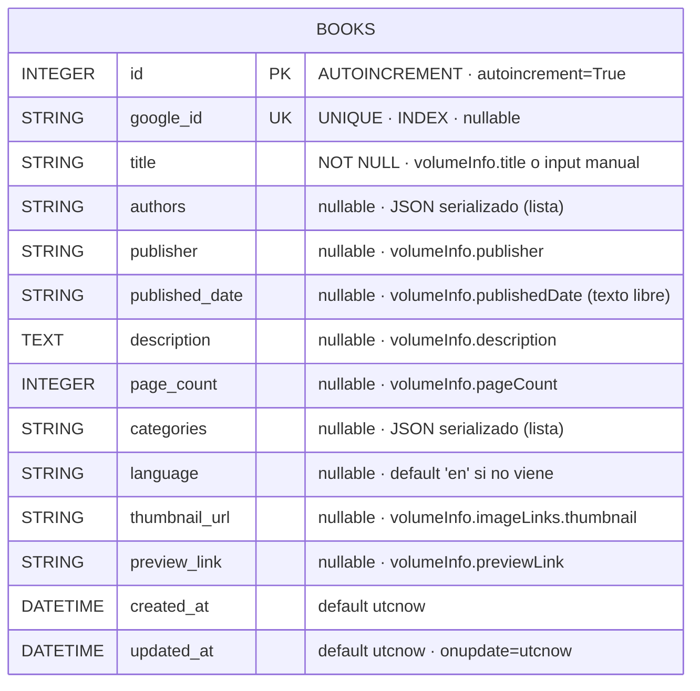
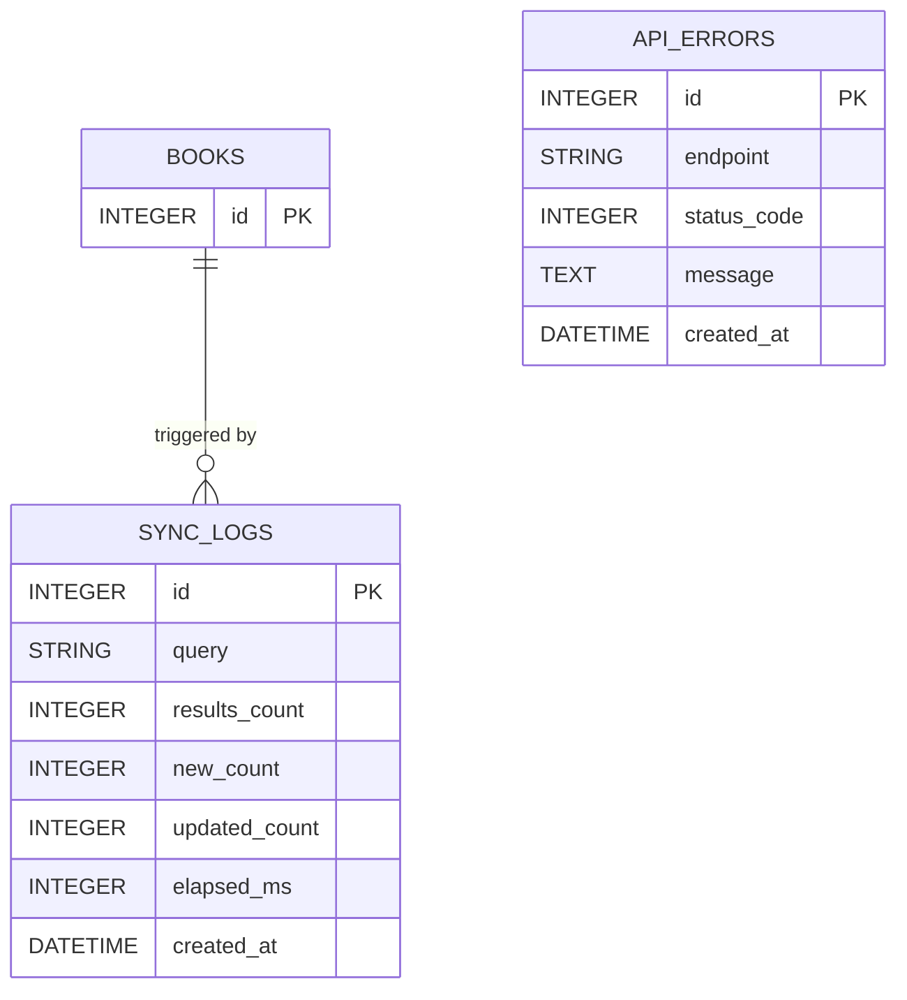

# Diagrama 2 — Modelo de datos (ER)

**Niveles cubiertos:** 4 (Procesamiento y almacenamiento de datos)

La aplicación persiste toda su información en una única tabla relacional `books`,
administrada por SQLAlchemy 2.x. Este diagrama muestra la estructura exacta definida en
`app/domain/models.py`, los tipos, las restricciones y el origen de cada campo (si viene
de Google Books o lo ingresa el usuario).

## Estrategia de deduplicación

- El campo `google_id` tiene constraint `UNIQUE` + `INDEX`. Es la clave de idempotencia:
  dos llamadas a `sync_from_query("python")` no crean duplicados, sino que **actualizan**
  la fila existente.
- `BookService.sync_from_query()` también aplica deduplicación **en memoria** dentro de
  la misma respuesta de Google (un `set` sobre los `google_id` de los `items` recibidos)
  para evitar inserts redundantes si la API devolviera IDs repetidos.
- Para libros creados manualmente (`POST /api/books` sin `google_id`), el campo queda
  `NULL` y se permite coexistir varios con el mismo título (no hay constraint de unicidad
  por título — es una decisión consciente, ver `docs/DECISIONS.md`).

## Estrategia de sincronización

- No hay columna `synced_at` separada. `updated_at` cubre la auditoría de cambios
  (incluyendo upserts desde Google).
- El volumen SQLite vive en `./data/app.db` y se monta como volumen Docker
  (`./data:/app/data` en `docker-compose.yml`).
- En Render free tier el filesystem es **efímero** (ver `docs/DEPLOY.md` §4): los libros
  se pierden en cada redeploy. Para producción real se recomienda PostgreSQL externo
  (Neon / Supabase) cambiando solo `DATABASE_URL`.

## Campos `JSON serializado como STRING`

`authors` y `categories` se guardan como `String` con un `json.dumps()` aplicado en
`BookService._parse_volume_info()`. Es una decisión pragmática para SQLite sin soporte
nativo de JSON, pero **es un trade-off explícito**:

- ✅ Portable: funciona igual en SQLite, Postgres y MySQL.
- ❌ No se puede consultar con `JSON` operators ni crear índices GIN.
- 🔄 Migración futura: cambiar a `JSONB` (Postgres) o `JSON` (MySQL 5.7+) según DB.

## Tablas futuras (no implementadas, referenciadas en `docs/DECISIONS.md`)

> No creadas todavía — la prueba priorizó un modelo simple y funcional. Quedan como
> "mejoras futuras" en el README.
