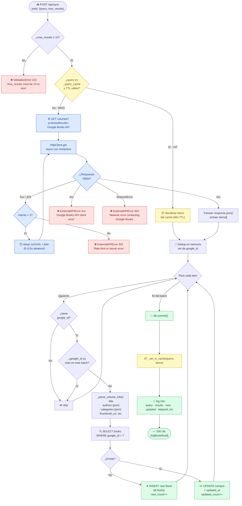

# Diagrama 3 — Flujo de sincronización (`POST /api/sync`)

**Niveles cubiertos:** 3 (Consumo de API externa) · 4 (Procesamiento y almacenamiento) · 6 (Integración)

Este diagrama de flujo describe el camino completo que recorre una petición
`POST /api/sync` desde que el cliente envía la consulta hasta que los libros quedan
persistidos en SQLite, incluyendo los caminos de caché, reintento, dedup, error y
validación.

## Reglas de negocio implementadas en el flujo

1. **Validación de entrada** — `max_results` está limitado a 10 en el `Pydantic Field`
   (`sync.py`) **y** se vuelve a verificar en `BookService.sync_from_query()` por
   seguridad. Es un cinturón + tirantes.
2. **Caché de consultas** — Implementado como `dict[str, tuple[list, float]]` en memoria
   del proceso. TTL de **60 s**. La clave es la query normalizada (lower + strip). No
   sobrevive reinicios. No es compartido entre réplicas.
3. **Reintentos con backoff exponencial y jitter** — Manejado en `HttpClient.get()`:
   hasta 3 intentos, delays `[1s, 2s, 4s]` con jitter `[0, 0.5s]`. Solo reintenta
   códigos `429, 500, 502, 503, 504`. Errores 4xx se devuelven al cliente de inmediato.
4. **Deduplicación en dos niveles**:
   - En memoria: `set` de `google_id` para no procesar el mismo libro dos veces en el
     mismo batch.
   - En DB: query `WHERE google_id = ?` para decidir INSERT vs UPDATE.
5. **Manejo de errores transaccionales** — Si algo falla a mitad del batch, `db.rollback()`
   en el `except`. No quedan filas inconsistentes.
6. **Auditoría por log** — `logger.info()` al final con métricas: query, results,
   new, updated, elapsed_ms. No hay tabla de auditoría persistente (mejora futura).
7. **`updated_at` automático** — SQLAlchemy `onupdate=datetime.utcnow` se dispara en
   cada UPDATE.

## Endpoints relacionados (mismo flujo, variaciones menores)

| Endpoint | Variación respecto al flujo |
|---|---|
| `POST /api/sync/seed?confirm=true` | Itera sobre 6 queries semilla en serie. Si una falla, aborta y devuelve 502 con el query que falló. |
| `POST /web/sync` (UI) | Mismo flujo, pero redirige con `?message=...` o `?error=...` en lugar de JSON. |
| `POST /web/books/add` | Variante "un solo libro": `get_by_id(google_id)` + INSERT con dedup. No usa caché. |
| `POST /web/search/google` | No persiste: solo llama a `search_books()` y muestra resultados en la UI. |
