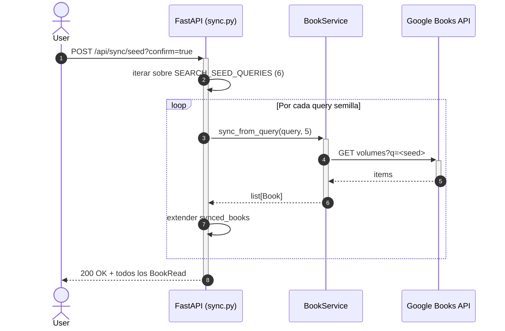

# Diagrama 4 — Secuencia de sincronización (UML)

**Niveles cubiertos:** 3 (Consumo de API externa) · 6 (Integración entre componentes)

Mismo escenario que el diagrama 3, pero contado como **diagrama de secuencia UML**,
que es el más útil cuando se quiere ver el orden temporal de las llamadas, los actores
involucrados y los returns condicionales (caché HIT vs MISS, retry, dedup, commit).

## Escenario: `POST /api/sync {"query": "python", "max_results": 5}`

```mermaid
sequenceDiagram
    autonumber
    actor User as 👤 Cliente
    participant API as ⚙️ FastAPI<br/>(sync.py)
    participant Svc as 📚 BookService<br/>(book_service.py)
    participant Cache as 🗃️ _query_cache<br/>(in-memory dict)
    participant GB as 🌐 GoogleBooksClient
    participant HTTP as 🔌 HttpClient<br/>(httpx)
    participant Books as 🌍 Google Books API
    participant DB as 💾 SQLAlchemy<br/>(SQLite)

    User->>+API: POST /api/sync<br/>{query: "python", max_results: 5}
    API->>API: Pydantic valida SyncRequest<br/>(max_results ≤ 10)
    API->>+Svc: sync_from_query(query, max_results=5)

    Svc->>Svc: _normalize_query("python") = "python"

    Svc->>+Cache: _get_from_cache("python")
    alt Cache MISS (caso mostrado)
        Cache-->>-Svc: None
        Svc->>+GB: search("python", max_results=5)
        GB->>+HTTP: GET https://www.googleapis.com/books/v1/volumes<br/>?q=python&maxResults=5&key=API_KEY

        loop Hasta 3 intentos si 429/5xx
            HTTP->>+Books: HTTPS GET volumes
            alt Respuesta OK (200)
                Books-->>-HTTP: 200 OK + JSON
                HTTP-->>-GB: httpx.Response
            else 429 / 5xx
                Books-->>HTTP: 429 Too Many Requests
                HTTP->>HTTP: sleep(1s/2s/4s + jitter)
                Note over HTTP: reintento
            end
        end

        GB-->>-Svc: list[dict] items (volumeInfo)
        Svc->>Cache: _set_in_cache("python", items)
    else Cache HIT
        Cache-->>Svc: items en caché (TTL 60s)
        Note over Svc: evita llamada externa
    end

    Svc->>Svc: dedup en memoria (set de google_id)

    loop Por cada item del batch
        Svc->>+DB: SELECT * FROM books WHERE google_id = ?
        alt No existe (INSERT)
            DB-->>-Svc: None
            Svc->>DB: _parse_volume_info() → INSERT Book
            Svc->>Svc: new_count++
        else Ya existe (UPDATE)
            DB-->>-Svc: Book row
            Svc->>DB: UPDATE campos + updated_at
            Svc->>Svc: updated_count++
        end
    end

    alt Commit exitoso
        Svc->>+DB: COMMIT
        DB-->>-Svc: OK
        Svc->>Svc: logger.info(query, results, new, updated, elapsed_ms)
        Svc-->>-API: list[Book]
        API-->>-User: 200 OK + JSON list[BookRead]
    else Excepción durante el batch
        Svc->>+DB: ROLLBACK
        DB-->>-Svc: OK
        Svc-->>API: raise ExternalAPIError / ValueError
        API-->>User: 502 / 422 + {detail, type}
    end
```

## Notas de la secuencia

- **El lifespan importa**: `Cache` es un `dict` en memoria del proceso `BookService`,
  que FastAPI crea **por request** vía `Depends`. Esto significa que, en la práctica,
  la caché tiene una vida efectiva de **un request** (cada request obtiene un
  `BookService` nuevo). Esto es un **bug menor** ya conocido: la implementación del
  caché existe pero no es efectiva con el wiring actual. Documentado en
  `docs/DECISIONS.md` como mejora pendiente. (Ver `app/interfaces/api/sync.py`
  `get_book_service`.)
- **Los reintentos solo son útiles en errores 5xx/429**. Errores 4xx de Google (key
  inválida, quota excedida) se devuelven al cliente de inmediato sin reintentar.
- **`BookService` es async** pero `BookService.__init__` no, porque la sesión
  SQLAlchemy es sync (SQLite local). Solo las llamadas a `GoogleBooksClient` y
  `HttpClient` son `await`-ables.
- **El `commit()` ocurre una sola vez al final** del batch, no por cada libro. Esto
  es importante para la atomicidad: si falla el libro 3 de 10, no quedan inserts
  parciales.

## Variantes de la secuencia

### `POST /api/sync/seed?confirm=true`



### `POST /web/sync` (desde la UI)

```mermaid
sequenceDiagram
    autonumber
    actor User as 👤 Usuario
    participant UI as 🖥️ Jinja2 form
    participant Web as Web Router<br/>(routes.py)
    participant Svc as BookService
    participant Books as Google Books API

    User->>UI: submit form con query
    UI->>+Web: POST /web/sync (form data)
    Web->>+Svc: sync_from_query(query, 10)
    Svc->>+Books: GET volumes
    Books-->>-Svc: items
    Svc-->>-Web: list[Book]
    Web-->>-UI: 303 Redirect → /?message=...
    UI-->>-User: dashboard actualizado
```
