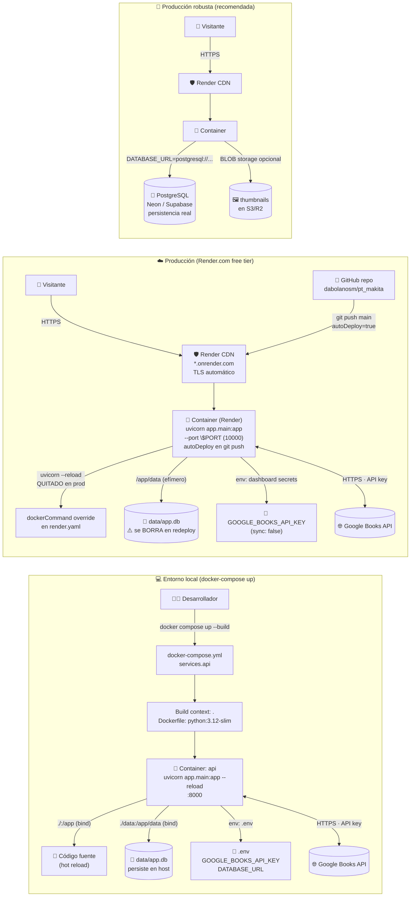
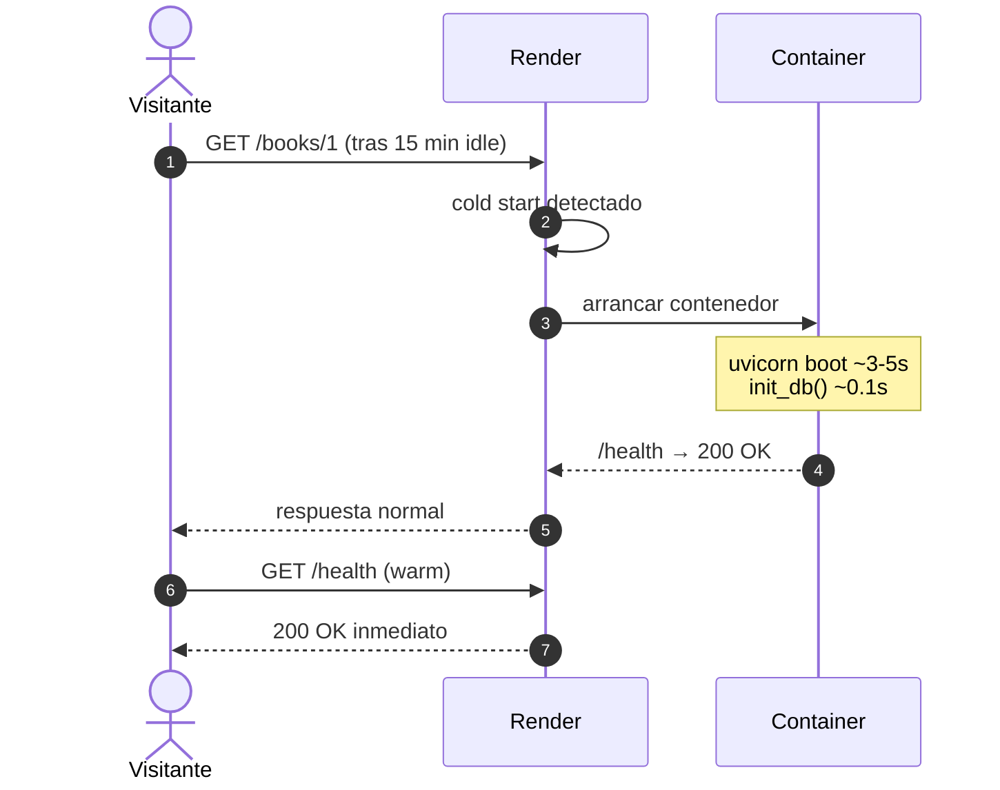

# Diagrama 5 — Despliegue (local vs producción)

**Niveles cubiertos:** 1 (Docker) · 7 (Publicación de la solución)

Este diagrama muestra las dos topologías reales que usa el proyecto:

1. **Local dev** con `docker-compose.yml` — un servicio `api` con el código montado
   como bind volume y SQLite persistida en `./data`.
2. **Producción** con Render.com + `render.yaml` — el mismo `Dockerfile` se construye
   en Render, expuesto vía HTTPS automático. SQLite vive en el **ephemeral filesystem**
   del contenedor (se pierde en cada redeploy — limitación documentada).

## Comparativa de las dos topologías

| Aspecto | Local dev | Producción Render (actual) | Producción robusta (futuro) |
|---|---|---|---|
| **Orquestador** | `docker-compose` (1 servicio) | Render (1 web service) | Render + DB externa |
| **Imagen** | Build local con `Dockerfile` | Build en Render con mismo `Dockerfile` | Igual |
| **Comando de inicio** | `uvicorn --reload --port 8000` | `uvicorn --port $PORT` (sin `--reload`) | Igual |
| **Persistencia DB** | `bind volume ./data` | **Efímera** (se pierde en redeploy) | PostgreSQL externo |
| **Variables de entorno** | Archivo `.env` (local) | Dashboard de Render (`sync: false` para secretos) | Idem |
| **HTTPS** | No (o proxy local) | Automático (`*.onrender.com`) | Automático + dominio custom posible |
| **Costo** | Gratis (tu máquina) | Gratis (con cold start) | ~$0–7/mes (Neon free + Render starter) |
| **CI/CD** | Manual (`docker compose up`) | `autoDeploy: true` en `render.yaml` | Idem |
| **Cold start** | N/A | 30–50 s tras 15 min sin tráfico | 30–50 s (mismo plan free) |

## Cold start en Render free tier

Render "duerme" el contenedor tras 15 minutos sin tráfico. El siguiente request tarda
30–50 s extra mientras el contenedor arranca. El **health check** está configurado en
`/health` (ver `render.yaml`) para que Render sepa cuándo el servicio está vivo.

## Decisiones de despliegue documentadas

- **Por qué Render y no Railway/Fly**: plan free funcional + Docker nativo + HTTPS
  automático + auto-deploy desde GitHub. Ver `docs/DEPLOY.md` §6 para comparativa
  honesta con alternativas.
- **Por qué no se modificó el código fuente para deploy**: `render.yaml` declara
  todo lo necesario sin tocar `app/`, `Dockerfile` ni `docker-compose.yml`. La
  portabilidad es una propiedad de diseño.
- **Por qué `docker-compose.yml` solo tiene 1 servicio**: la prueba no requería
  contenedor de DB separado (SQLite vive dentro del mismo contenedor). En producción
  real, separar DB y API es obligatorio — por eso el diagrama futuro muestra Postgres
  externo.
